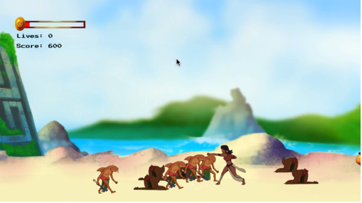

# The Winds of Boriken, a 2D Beat-em-up game
This repository is used to backup and share all the scripts created during the development of _The Winds of Boriken_, a 2D beat-em-up game inspired by the mythology of the indigenous people of Puerto Rico, the Taino. The project was developed with the Unity game engine in C#, though only the scripts are stored here. The game is not yet publicly available for play, but the core gameplay scripts are complete, including player movement, combat, local split keyboard multiplayer, enemy AI random state machines, enemy spawners and wave events, in game cinematics and boss fights, start and game over menus, player UI, various gameplay managers, and more. Documentation about the game created as part of the Senior Project class at St. Mary's University can be found in the "Documentation" folder. The game was made in partnership with David Monsegur, an art student at UTSA who drew the majority of the visual assets used in the game by hand.

Below are some screenshots of the game in action, though not all assets have been completed. 

### Main Menu 

### Options Menu

Currently the only adjustable option is the master volume, though the PlayerPrefsController class could easily be expanded to keep track of more options, like difficulty level. The use of PlayerPrefs means the volume is saved between sessions and remains the same throughout all scenes. 

### Level Select

In the beginning only the tutorial and the first level are available, the rest are greyed out and unselectable, but unlock as levels are completed. This system is also implemented using PlayerPrefs. While this means players could unlock all the levels on their own in the game files, that would not break the game or experience, so saving and loading using serialization was not deemed necessary. 

### Gameplay

The game is playable in both singleplayer and local multiplayer on the same keyboard. A second player can be added at any time through the pause menu. At the moment there is only one player model, so the players are differentiated with a label. In the future I would like to implement a player select screen to determine the number of players and their characters before starting the game. 
  

In typical beat 'em up fashion, as players move through the level the camera will occasionally lock and force the player to defeat waves of enemies before moving on. Players can use a mix of ground attacks, grab attack/throw, and air attacks while jumping to defeat these enemies. Grabbed enemies can be thrown into other enemies to knock them down, though the scripting prevents a cascading domino effect. 

### Respawning in Multiplayer 

While in two-player, if one of the players runs out of lives, rather than have to wait for the other player to finish the level, a spawn timer will appear and automatically respawn the coop partner when the time runs out. If both players run out of lives, then they must restart the level. 

### Pause Menu

The pause menu freezes the action on the screen and lets the players return to the main menu, view the controls, add/remove the second player, or access an options menu that functions much the same as the one found in the main menu.

### Game Over 

When the player runs out of lives, they have the option to either quit or restart the level.

### Boss Dialogue

A dialogue system was created for interaction with NPCs. When the player crosses certain invisible colliders, the dialogue box will come down for the player to read through. This particular encounter also zooms in the camera to force the player into a close quarters encounter with this enemy that has stronger attacks that can knock players down. 

### Level Complete 

Upon completing the level, player scores are shown and moving to the next level will unlcok it in the level select screen. 
